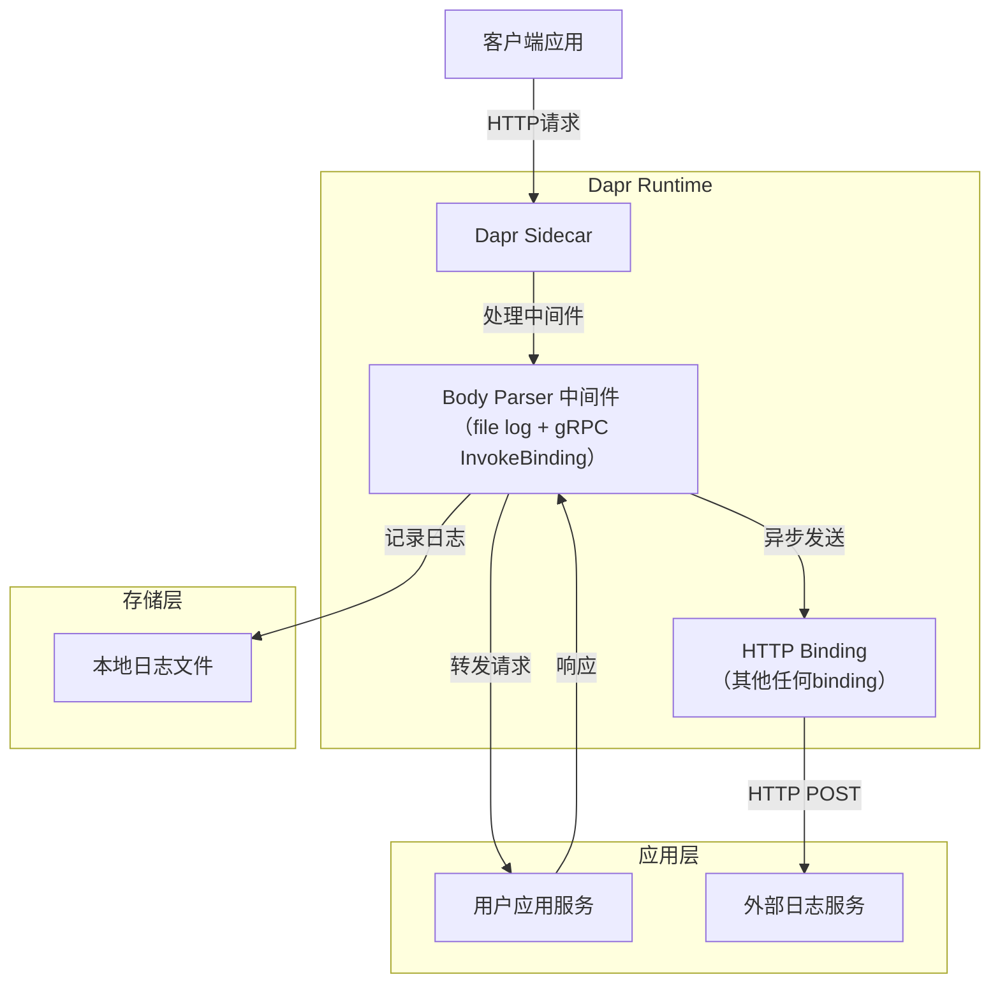
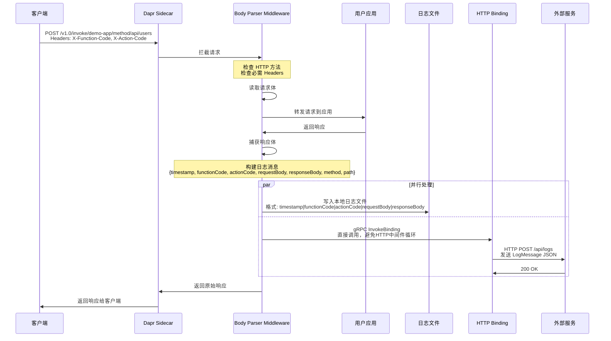

# Body Parser 中间件演示

这个演示程序展示了如何使用 Dapr 的 HTTP Body Parser 中间件来记录请求和响应体。

## 架构概览

### 系统架构图



### 数据流时序图



### 关键组件说明

#### 1. Body Parser 中间件
- **位置**: Dapr Sidecar 内部
- **功能**: 拦截 HTTP 请求/响应，提取并记录消息体
- **触发条件**: 
  - HTTP 方法匹配配置 (默认: POST, PUT, DELETE)
  - 包含必需的 Headers (X-Function-Code, X-Action-Code)
- **输出**: 本地文件 + HTTP Binding

#### 2. HTTP Binding
- **类型**: `bindings.http`
- **作用**: 将日志数据异步发送到外部 HTTP 端点
- **数据格式**: 直接发送 LogMessage JSON (不包装 operation)
- **目标**: 外部日志处理服务

#### 3. 数据格式转换

**中间件内部格式**:
```json
{
  "timestamp": "2024-01-15T10:31:00Z",
  "functionCode": "USER_MODULE",
  "actionCode": "CREATE_USER",
  "requestBody": "{\"name\": \"张三\"}",
  "responseBody": "{\"id\": 1, \"name\": \"张三\"}",
  "method": "POST",
  "path": "/api/users"
}
```

**文件日志格式**:
```
2024-01-15T10:31:00Z|USER_MODULE|CREATE_USER|{"name": "张三"}|{"id": 1, "name": "张三"}
```

**HTTP Binding 发送格式**:
```json
{
  "operation": "create",
  "data": {
    "timestamp": "2024-01-15T10:31:00Z",
    "functionCode": "USER_MODULE",
    "actionCode": "CREATE_USER",
    "requestBody": "{\"name\": \"张三\"}",
    "responseBody": "{\"id\": 1, \"name\": \"张三\"}",
    "method": "POST",
    "path": "/api/users"
  }
}
```

**外部服务接收格式**:
```json
{
  "timestamp": "2024-01-15T10:31:00Z",
  "functionCode": "USER_MODULE",
  "actionCode": "CREATE_USER",
  "requestBody": "{\"name\": \"张三\"}",
  "responseBody": "{\"id\": 1, \"name\": \"张三\"}",
  "method": "POST",
  "path": "/api/users"
}
```

> **注意**: HTTP Binding Output 会自动提取 `data` 字段作为 HTTP Body 发送，因此外部服务直接接收到 LogMessage JSON。

## 文件日志的运行演示

### 1. 启动应用

```bash
# 确保在 dapr 项目根目录
cd /workspaces/dapr

# 编译包含 body 中间件的 daprd
make build

# 切换到演示目录
cd examples/middleware-body-demo

# daprd 软连接
ln -s /workspaces/dapr/dist/linux_arm64/release/daprd /usr/local/bin/daprd

# 使用 dist/linux_arm64/release/daprd 启动应用
daprd \
  --app-id demo-app \
  --app-port 8080 \
  --dapr-http-port 3500 \
  --config dapr-config.yaml \
  --components-path ./components

# 运行测试程序
go run main.go
```

### 2. 测试 API

```bash
# 健康检查
curl http://localhost:3500/v1.0/invoke/demo-app/method/health

# 创建用户（带功能码和动作码）
curl -X POST http://localhost:3500/v1.0/invoke/demo-app/method/api/users \
  -H "Content-Type: application/json" \
  -H "X-Function-Code: USER_MODULE" \
  -H "X-Action-Code: CREATE_USER" \
  -d '{"name": "张三", "email": "zhangsan@example.com"}'

# 获取所有用户
curl http://localhost:3500/v1.0/invoke/demo-app/method/api/users

# 获取所有用户（带功能码和动作码）
curl http://localhost:3500/v1.0/invoke/demo-app/method/api/users \
  -H "X-Function-Code: USER_MODULE" \
  -H "X-Action-Code: LIST_USERS"

# 获取特定用户（带功能码和动作码）
curl http://localhost:3500/v1.0/invoke/demo-app/method/api/users/1 \
  -H "X-Function-Code: USER_MODULE" \
  -H "X-Action-Code: GET_USER"
```

### 3. 查看日志

```bash
# 查看 body 中间件日志
cat middleware-body.log
```

## 预期输出

日志文件 `middleware-body.log` 将包含五列格式的数据：

**格式：功能码|动作码|请求体|响应体|时间戳**

```
USER_MODULE|CREATE_USER|{"name": "张三", "email": "zhangsan@example.com"}|{"id":1,"name":"张三","email":"zhangsan@example.com","created":"2024-01-15T10:31:00.456Z"}|2024-01-15T10:31:00Z
```

**注意：** 
- 默认只记录 POST 请求（可通过配置 `logMethods` 修改）
- 没有带功能码和动作码 header 的请求也不会出现在日志中

## 配置选项

你可以修改 `dapr-config.yaml` 中的中间件配置：

- `logFile`: 更改日志文件路径
- `logRequest`: 设置为 `false` 禁用请求体记录
- `logResponse`: 设置为 `false` 禁用响应体记录  
- `maxBodySize`: 调整最大记录体大小
- `functionHeader`: 指定功能码的 header 名称（默认：X-Function-Code）
- `actionHeader`: 指定动作码的 header 名称（默认：X-Action-Code）
- `logMethods`: 指定需要记录日志的HTTP方法，用逗号分隔（默认：POST,PUT,DELETE）
- `bindingName`: 指定发送日志的 Dapr binding 名称（可选）
- `includePaths`: 指定需要记录日志的URL路径正则表达式，用逗号分隔多个模式（可选）
- `excludePaths`: 指定需要排除记录日志的URL路径正则表达式，用逗号分隔多个模式（可选）

**注意：** 
- 默认只记录 POST、PUT、DELETE 请求，可通过 `logMethods` 配置修改
- 如果配置了 `bindingName`，日志将通过 Dapr gRPC API 异步发送到外部系统
- 使用 gRPC API 调用 binding，避免 HTTP 中间件循环问题
- Dapr gRPC 端口会自动从运行时环境变量 `DAPR_GRPC_PORT` 获取
- 如果请求中缺少功能码或动作码 header，中间件将不会记录任何日志
- 路径过滤规则：先检查包含列表（如果配置），再检查排除列表
- 路径过滤支持正则表达式，如果正则表达式编译失败会记录警告并跳过该模式

### 配置示例

**记录所有HTTP方法：**
```yaml
- name: logMethods
  value: "GET,POST,PUT,DELETE,PATCH"
```

**只记录写操作：**
```yaml
- name: logMethods
  value: "POST,PUT,DELETE"
```

**只记录POST请求：**
```yaml
- name: logMethods
  value: "POST"
```

**使用 binding 发送日志：**
```yaml
- name: bindingName
  value: "log-binding"
```

**路径过滤配置：**
```yaml
# 只记录 API 路径
- name: includePaths
  value: "^/api/.*"

# 排除静态资源和健康检查
- name: excludePaths
  value: "/health,/metrics,.*\\.css,.*\\.js,.*\\.png"

# 组合使用：只记录API路径但排除某些特定路径
- name: includePaths
  value: "^/api/.*"
- name: excludePaths
  value: "/api/health,/api/metrics"
```

## 路径过滤功能

中间件支持基于URL路径的日志过滤，使用正则表达式进行灵活的路径匹配。

### 过滤规则

1. **包含路径（includePaths）**：
   - 如果配置了包含路径，只有匹配这些模式的请求才会被记录
   - 支持多个正则表达式模式，用逗号分隔
   - 如果未配置，则默认包含所有路径

2. **排除路径（excludePaths）**：
   - 匹配这些模式的请求将被排除，不会记录日志
   - 支持多个正则表达式模式，用逗号分隔
   - 排除规则在包含规则之后执行

3. **执行顺序**：
   ```
   请求 → HTTP方法检查 → 路径包含检查 → 路径排除检查 → Header检查 → 记录日志
   ```

### 常用正则表达式模式

- `^/api/.*` - 匹配所有以 `/api/` 开头的路径
- `/health` - 精确匹配 `/health` 路径
- `.*\\.css` - 匹配所有 CSS 文件
- `/api/(users|orders)/.*` - 匹配用户或订单相关的API路径
- `/v[0-9]+/.*` - 匹配带版本号的API路径（如 `/v1/`, `/v2/`）

## Binding 集成

中间件支持通过 Dapr binding 将日志异步发送到外部系统，这样可以实现更灵活的日志处理。

### 日志消息格式

**外部服务实际接收到的格式**：

```json
{
  "timestamp": "2024-01-15T10:31:00Z",
  "functionCode": "USER_MODULE",
  "actionCode": "CREATE_USER",
  "requestBody": "{\"name\": \"张三\", \"email\": \"zhangsan@example.com\"}",
  "responseBody": "{\"id\":1,\"name\":\"张三\",\"email\":\"zhangsan@example.com\"}",
  "method": "POST",
  "path": "/api/users"
}
```

**说明**：虽然中间件内部按照 Dapr binding API 规范发送包含 `operation` 和 `data` 的完整请求，但 HTTP binding output 会自动提取 `data` 字段的内容作为 HTTP body 发送给外部服务。

### 支持的 Binding 类型

- **HTTP Binding**: 发送到外部 HTTP 端点
- **Kafka Binding**: 发送到 Kafka 消息队列
- **RabbitMQ Binding**: 发送到 RabbitMQ 队列
- **Redis Binding**: 发送到 Redis
- 以及其他 Dapr 支持的 binding 类型

### 外部系统处理示例

外部系统可以接收到完整的日志数据并进行处理，例如：

- 数据分析和统计
- 实时监控和告警
- 审计日志存储
- 业务指标计算

#### 运行示例日志接收服务

项目包含一个简单的日志接收服务示例：

```bash
# 启动日志接收服务
go run log-receiver.go

# 服务将在 http://localhost:8090/api/logs 接收日志
```

该服务会接收并处理来自中间件的日志消息，并根据模块码和动作码进行不同的处理。

### 包含binding的运行演示

#### 1. 组件配置

**中间件配置** (`components/body-logger.yaml`):
```yaml
apiVersion: dapr.io/v1alpha1
kind: Component
metadata:
  name: body-logger
spec:
  type: middleware.http.body
  version: v1
  metadata:
  - name: logFile
    value: "./middleware-body.log"
  - name: bindingName
    value: "log-binding"
  - name: logMethods
    value: "POST,PUT,DELETE"
```

**HTTP Binding 配置** (`components/log-binding.yaml`):
```yaml
apiVersion: dapr.io/v1alpha1
kind: Component
metadata:
  name: log-binding
spec:
  type: bindings.http
  version: v1
  metadata:
  - name: url
    value: "http://localhost:8090/api/logs"
  - name: method
    value: "POST"
```

**应用配置** (`dapr-config.yaml`):
```yaml
apiVersion: dapr.io/v1alpha1
kind: Configuration
metadata:
  name: appconfig
spec:
  httpPipeline:
    handlers:
    - name: body-logger
      type: middleware.http.body
```

#### 2. 启动流程

```bash
# 1. 启动外部日志服务
go run log-receiver.go

# 2. 启动 Dapr 应用
daprd --app-id demo-app --app-port 8080 --dapr-http-port 3500 \
  --config dapr-config.yaml --components-path ./components

# 3. 启动用户应用
go run main.go 

# 4. 发送测试请求
curl -X POST http://localhost:3500/v1.0/invoke/demo-app/method/api/users \
  -H "Content-Type: application/json" \
  -H "X-Function-Code: USER_MODULE" \
  -H "X-Action-Code: CREATE_USER" \
  -d '{"name": "张三", "email": "zhangsan@example.com"}'
```

#### 3. 验证结果

- **本地文件**: `cat middleware-body.log`
- **外部服务**: 查看 log-receiver.go 的控制台输出
- **Dapr 日志**: 查看 daprd 的日志输出

## 故障排除

### 常见问题

1. **确保 Dapr 已安装**：
   ```bash
   dapr --version
   ```

2. **确保端口未被占用**：
   ```bash
   lsof -i :8080
   lsof -i :3500
   ```

3. **检查 Dapr 日志**：
   ```bash
   # 在另一个终端查看 Dapr 日志
   dapr logs --app-id demo-app
   ```

4. **验证中间件注册**：
   确保你使用的是包含 body 中间件的 daprd 版本。

### Binding 相关问题

#### 错误：`operation field is missing from request`

**问题已修复**：中间件现在正确发送符合 Dapr binding API 规范的请求，包含必需的 `operation` 字段。

#### 错误：`Binding log-binding returned status 500`

**可能原因和解决方案：**

1. **外部服务未运行**：
   ```bash
   # 确保日志接收服务正在运行
   go run log-receiver.go
   ```

2. **Binding 组件配置错误**：
   ```bash
   # 检查 binding 组件是否正确配置
   cat components/log-binding.yaml
   ```

3. **URL 配置错误**：
   - 确保 HTTP binding 的 URL 正确指向接收服务
   - 默认应该是 `http://localhost:8090/api/logs`

4. **网络连接问题**：
   ```bash
   # 测试 binding 连接（现在使用正确的格式）
   curl -X POST http://localhost:3500/v1.0/bindings/log-binding \
     -H "Content-Type: application/json" \
     -d '{"operation": "create", "data": {"test": "message"}}'
   ```

5. **启用调试日志**：
   ```bash
   # 启动 daprd 时启用调试日志
   daprd --app-id demo-app --log-level debug
   ```

#### 日志未出现在接收服务

1. **检查请求是否包含必要的 header**：
   ```bash
   curl -X POST http://localhost:3500/v1.0/invoke/demo-app/method/api/users \
     -H "Content-Type: application/json" \
     -H "X-Function-Code: USER_MODULE" \
     -H "X-Action-Code: CREATE_USER" \
     -d '{"name": "测试", "email": "test@example.com"}'
   ```

2. **确认请求方法在 logMethods 配置中**：
   - 默认只记录 POST、PUT、DELETE 请求
   - GET 请求默认不记录

3. **检查中间件配置**：
   - 确保 `bindingName` 配置正确
   - 确保组件名称匹配
